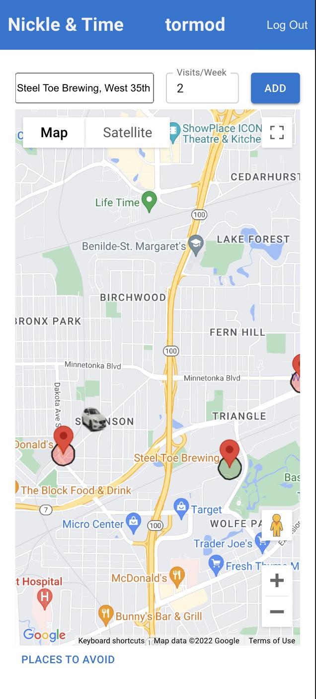

# Nickle & Time

## Description

_Duration: 2 Week Sprint_

Nickle & Time lets the user add locations on a google map that they would like to avoid or only visit a few times per week. Using the user's current location it will detect if they are close to one of those places, and send them a friendly text message based on how many times they have visisted.

 

## Screen Shot

## Installation

1. Go to https://github.com/tormodsletteboe/NickleAndTime
2. Fork that repo into your own github account.
3. Copy the ssh address
4. In your terminal navigate to a folder you want to clone into.
5. Run `git clone [ssh address]` in your terminal
6. cd into the cloned folder and run `code .` in your terminal to open the project in vscode.
7. Run 'npm install'. Npm will look at your dependecies and install needed libraries.
8. Install postgress database using include database.sql file
    -  in termial execute  'createdb prime_app' and 
    -  'psql -d prime_app -f database.sql'
9. To start, execute in 2 separate terminals, 'npm run server' and 'npm run client'.
10. If it started, terminal will display 'server is up on port 5000', and a website on localhost 3000 will open.
11. You can now enjoy Nickle & Time.

## Usage

1. Click on a movie poster to learn more about it
2. On the details page of the movie clicked
    - Click the down arrow icon to read the description
    - Click the DELETE button to delete the movie. A modal will appear with Are you sure?
    - Click pencil icon to edit the movies Title, Image, or Description.
3. To go back to the home screen, click BACK TO LIST button
4. Movies can be added in the Add New Movie page.
    - Fill in: 
        - Title
        - Image Url
        - Genre
        - Description
     - Click Save or Cancel.
        - Save will save the Movie to the database and bring user to homepage
        - Cancel will not save anything and take user to the homepage.
     

### Prerequisites

Link to software that is required to develop this website.

    "@emotion/react": "^11.10.5",
    "@emotion/styled": "^11.10.5",
    "@fontsource/roboto": "^4.5.8",
    "@googlemaps/react-wrapper": "^1.1.35",
    "@mui/icons-material": "^5.10.14",
    "@mui/material": "^5.10.14",
    "@reach/combobox": "^0.18.0",
    "@react-google-maps/api": "^2.17.0",
    "axios": "^0.21.1",
    "bcryptjs": "^2.4.3",
    "cookie-session": "^2.0.0",
    "dotenv": "^8.6.0",
    "express": "^4.17.1",
    "node-cron": "^3.0.2",
    "passport": "^0.4.1",
    "passport-local": "^1.0.0",
    "pg": "^8.5.1",
    "prop-types": "^15.7.2",
    "react": "^17.0.2",
    "react-dom": "^17.0.2",
    "react-redux": "^7.2.6",
    "react-router-dom": "^5.2.0",
    "react-scripts": "^5.0.1",
    "redux": "^4.1.2",
    "redux-logger": "^3.0.6",
    "redux-saga": "^1.1.3",
    "twilio": "^3.83.3",
    "use-places-autocomplete": "^4.0.0"
- [javascript](https://www.javascript.com/)
- [css]()
- [html]()
- [git](https://git-scm.com/)
- [github](https://github.com/)
- [body-parser](https://www.npmjs.com/package/body-parser)
- [pg](https://node-postgres.com/)
- [react](https://reactjs.org/)
- [redux](https://redux.js.org/)
- [axios](https://axios-http.com/)
- [express](https://expressjs.com/)
- [sql](https://www.mysql.com/)
- [sweetalerts2](https://sweetalert2.github.io/)
- [Sagas](https://redux-saga.js.org/)
- [Material UI](https://mui.com/)

## Acknowledgement
Thanks to [Prime Digital Academy](www.primeacademy.io) who equipped and helped us to make this application a reality. (Edan Schwartz, Kris Szafranski)

## Support
If you have suggestions or issues, please email me at [tormod.slettebo@gmail.com] 

